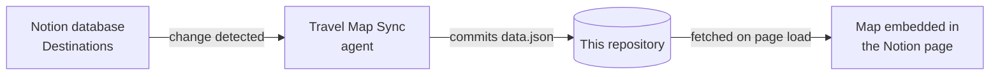

# Travel Bucket List — the map behind it

This repository is the engine room for a personal travel map. The map itself lives at the
top of a Notion page called **Travel Bucket List**: a world map where every country I have
visited is green, countries I am actively planning are blue, and everything still on the
wishlist is sand-coloured.

The point of the whole setup is that **nobody ever edits the map**. You add a destination to
a list in Notion, the way you would add a line to any to-do list, and the map redraws itself
a few seconds later. This README explains how that works, first in plain language and then
in detail.

---

## The short version

There are three parts:

1. **A list in Notion.** A database called *Destinations*. One row per trip — "Japan",
   "Machu Picchu", "Budapest & Prague". Each row has a status: *In Review*, *Want to go*,
   *In Planning* or *Visited*.
2. **This repository.** It holds a single small file, `data.json`, which is a stripped-down
   copy of that list: just the name, the status, the budget, and which countries the trip
   covers. Nothing private, nothing else.
3. **The map.** An HTML file embedded in the Notion page. When it loads it downloads
   `data.json` from here and colours the countries accordingly.

The interesting question is what keeps step 2 in sync with step 1. The answer is a **Notion
agent** — an assistant that sits and watches the database, and writes to this repository
whenever something changes. There is no server, no cron job, and no scheduled build.



---

## What an "agent" is, if that word means nothing to you

In Notion, an agent is an assistant you can give standing instructions to, plus a list of
events that should wake it up. It is not a program in the traditional sense — the
instructions are written in plain English, on a page, and can be edited like any other page.

This system uses one agent for the map, and one for quality control.

### Travel Map Sync

Its standing instruction is, roughly: *read every destination in the database, work out which
countries each one covers, and write the result to `data.json` in this repository — but only
if the result would actually be different from what is already there.*

It wakes up when:

| Event | Why |
| --- | --- |
| A destination is created | New pin on the map |
| Status, Budget or Continent changes | The colour or the tooltip changes |
| A destination is deleted | The country should stop being coloured |
| Once an hour, regardless | Safety net — see below |

That last one matters more than it looks. Event-driven systems miss events; it is a question
of when, not if. Because every run rewrites the **complete** list rather than patching the
difference, a missed event repairs itself at the top of the next hour without anyone
noticing. This is the same reasoning behind "desired state" tools like Terraform or
Kubernetes: describing the end state is more robust than describing the change.

### Bucket List Approver

New ideas land with status **In Review**. They are deliberately excluded from `data.json`, so
a half-formed thought does not immediately paint a country on the map. Approving one flips it
to *Want to go*, which is when it appears. The approver agent handles that review step.

---

## How a destination becomes a coloured country

A map does not understand "Backpack South East Asia". It understands country shapes, and
those shapes are keyed by **ISO 3166-1 numeric codes** — an international standard where every
country has a number. Germany is 276, Japan is 392, Italy is 380.

So every destination needs at least one code. They come from two places, in order:

1. **The `Map countries` property on the Notion page.** Type `276` for Berlin, or `32, 152`
   for a Patagonia trip that spans Argentina and Chile. This is the preferred route: a brand
   new destination can map itself with no change to this repository at all.
2. **`codes.json` in this repository**, which maps destination names to codes for the rows
   that predate that property.

If a destination has neither, it is not silently dropped. It is listed in `data.json` under
`unmapped`, so the failure is visible rather than invisible.

Three destinations are too small to see at map scale — Hong Kong, Singapore, the Maldives —
so the map draws them as dots at fixed coordinates instead of trying to fill a shape.

### Colours

| Status | Colour | On the map |
| --- | --- | --- |
| Visited | green | "Been there" |
| In Planning | blue | actively being booked |
| Want to go | sand | the wishlist |
| In Review | — | excluded on purpose |

When two destinations cover the same country with different statuses, the stronger one wins:
visited beats planning beats wishlist. Italy is green if you have been to Rome, even if the
Dolomites are still a wish.

---

## The data contract

`data.json` is generated. Do not edit it by hand — the next agent run will overwrite you.

```json
{
  "generatedAt": "2026-09-06T07:08:48Z",
  "source": "notion",
  "unmapped": [],
  "destinations": [
    { "name": "Berlin", "status": "Visited", "budget": "$", "c": [276], "continent": "Europe" },
    { "name": "Patagonia", "status": "Want to go", "budget": "$$$$", "c": [32, 152], "continent": "South America" }
  ]
}
```

- `c` is the list of ISO 3166-1 numeric country codes.
- `generatedAt` is stamped by the agent and shown in the map's footer, which is how you can
  tell at a glance whether you are looking at fresh data.
- `source` is `notion` for a real sync. Anything else means the file did not come from the
  database.

## Files

| File | What it is |
| --- | --- |
| `data.json` | Generated by the agent on every sync. The only file that changes routinely. |
| `codes.json` | Destination name to country codes. Hand-maintained fallback. |
| `README.md` | This file. |

That is the entire repository, and the shortness is deliberate.

---

## Things that were tried and abandoned

Worth recording, because both are the obvious first idea:

**A scheduled GitHub Action that pulls from the Notion API.** It works, but it needs a Notion
API token stored as a repository secret, it runs on a five-minute cron whether anything
changed or not, and a token in a repository is a small permanent liability. It has been
deleted. If you find references to `NOTION_TOKEN` anywhere, they are stale.

**Letting the map talk to Notion directly.** Not possible from a browser without exposing a
credential to anyone who views the page. The static-file-in-the-middle approach means the
map only ever reads a public file containing nothing sensitive.

---

## Troubleshooting

**The map's footer says "offline copy from ..." instead of "live from Notion".**
The map ships with a baked-in copy of the last known data, so a network failure shows a
slightly stale map rather than an empty one. That message means the map could not download
`data.json`. It does *not* mean the data is wrong. Check that the file is reachable in a
browser:

```
https://raw.githubusercontent.com/benhoch-dev/notion-travel-bucket-list/main/data.json
```

**A change in Notion has not appeared yet.**
`raw.githubusercontent.com` serves through a cache that can hold a file for a few minutes.
The map adds a cache-busting parameter to each request, but the underlying cache still wins
occasionally. Waiting is the fix; the hourly run is the backstop.

**This repository moved.** It used to live under a personal account and now lives in the
`benhoch-dev` organisation. Old `hochben/...` URLs still redirect, but browsers refuse
redirected cross-origin requests, so anything fetching `data.json` must use the
`benhoch-dev` address. A tool that follows redirects will report success while a browser
quietly fails — which is exactly the trap that cost an afternoon.
